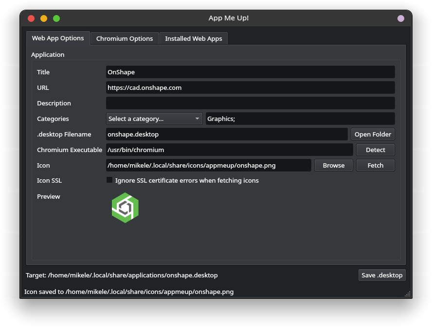
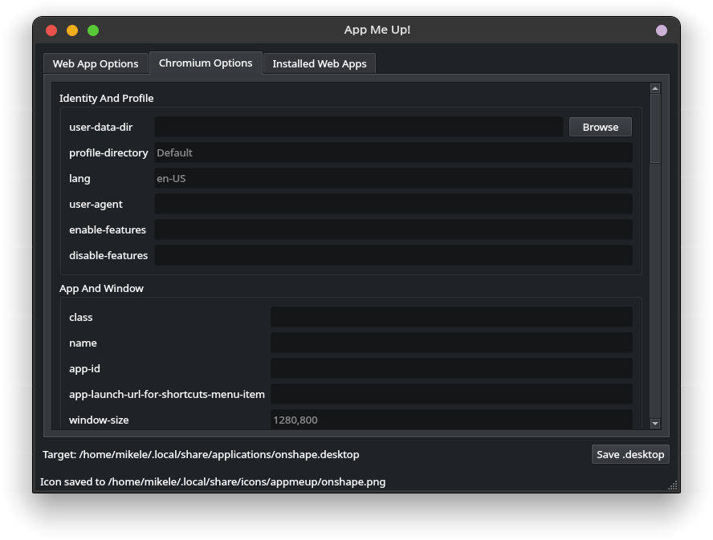
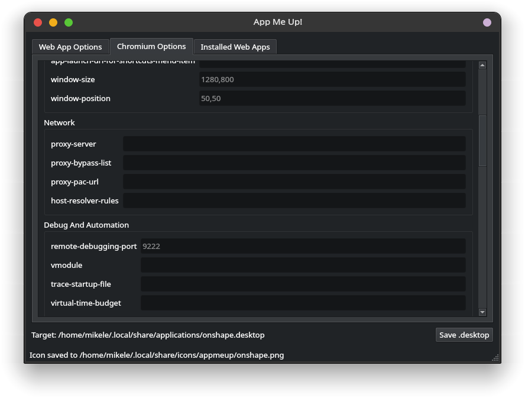
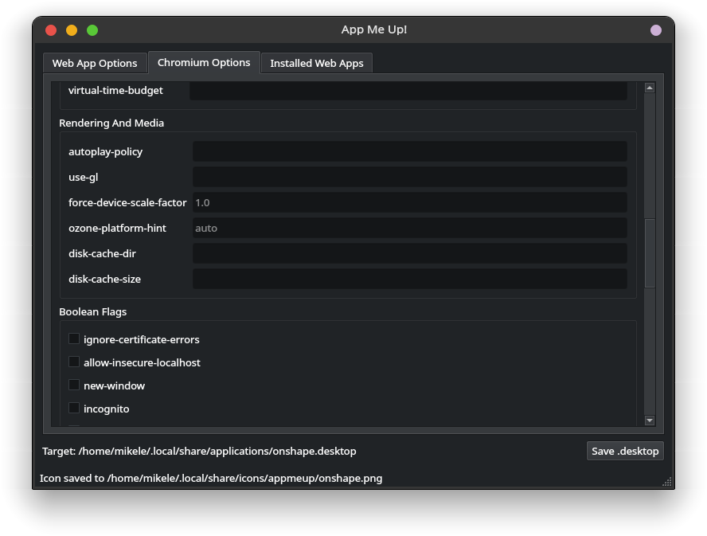
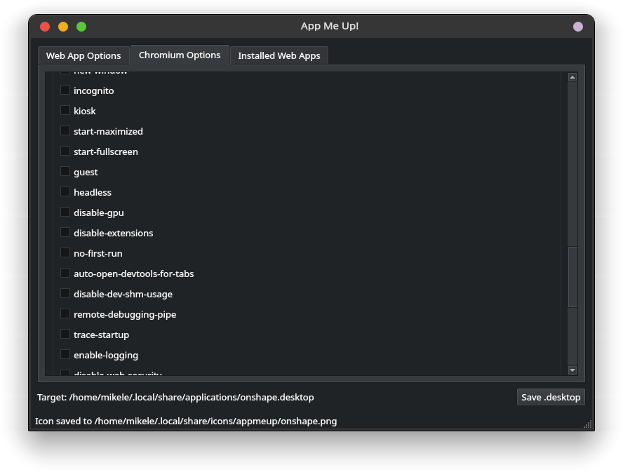
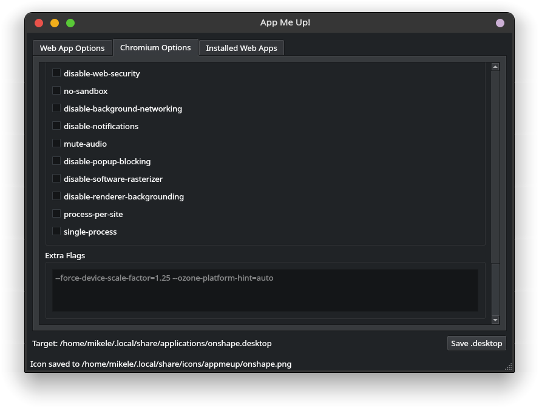
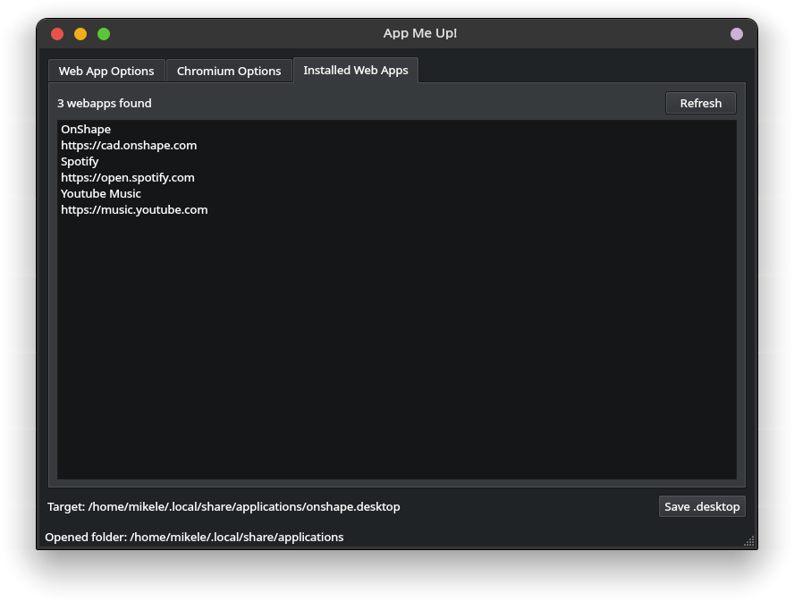

# AppMeUp!

Desktop app for creating and editing Chromium-based web apps from `.desktop` launchers.

## Features

- Create user-level web app launchers in `~/.local/share/applications`
- Edit existing Chromium web apps
- Fetch site icons automatically when possible
- Refresh the desktop app menu after changes

## Screenshots

 
 
 
 
 
 
 

## Run

```bash
python3 -m venv .venv
source .venv/bin/activate
pip install -r requirements.txt
python3 appmeup.py
```

Open an existing launcher:

```bash
python3 appmeup.py ~/.local/share/applications/example.desktop
```

## Build

```bash
./scripts/install-build-deps.sh
./scripts/build-standalone.sh
# or
./scripts/build-onefile.sh
```

Install a built binary locally:

```bash
./scripts/install.sh
```
