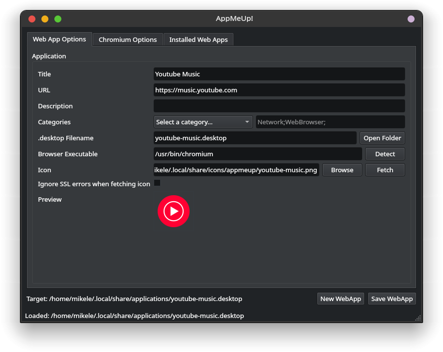
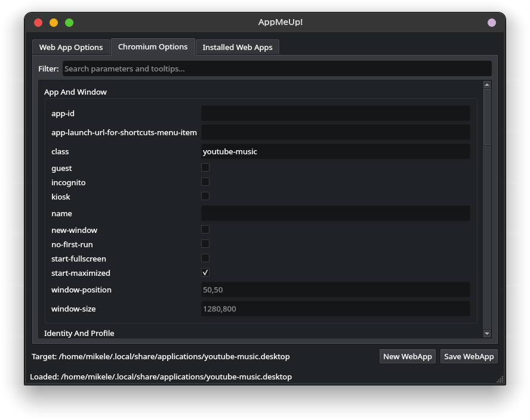
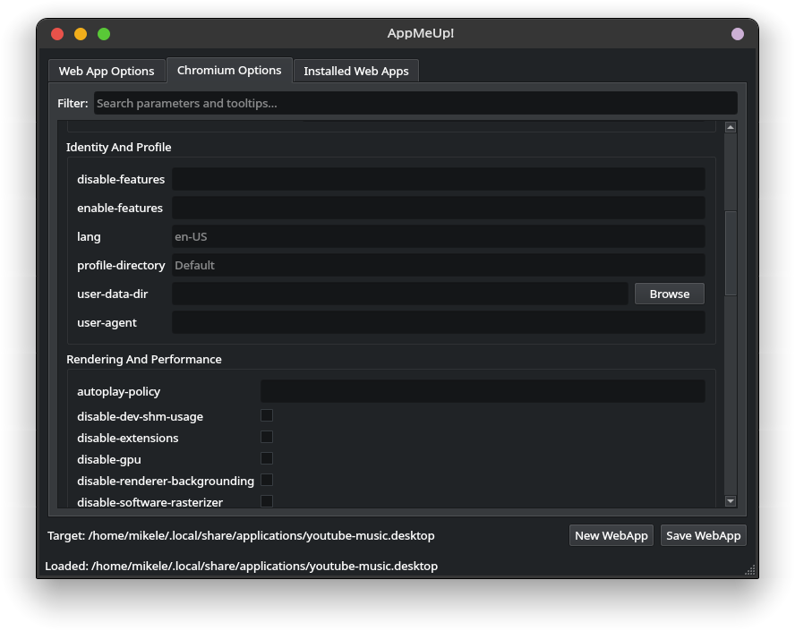
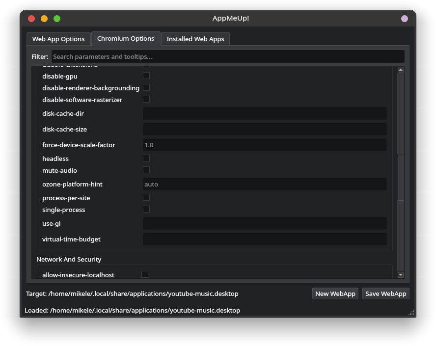
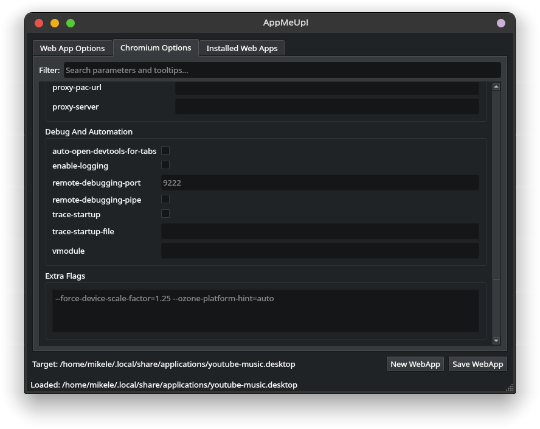
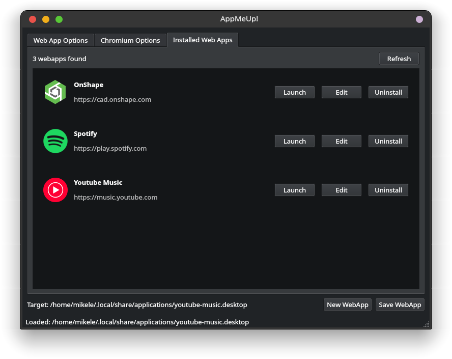

# AppMeUp!

A desktop app for creating and editing Chromium-based web apps in Linux.

## Features

- Create user-level web app launchers in `~/.local/share/applications`
- Show AppMeUp-created web apps in the installed list
- Launch installed web apps directly from the GUI
- Edit or uninstall installed AppMeUp web apps from the GUI
- Uninstall also cleans up the web app's profile data directory
- Use `New WebApp` and `Save WebApp` actions in the app UI
- Fetch site icons automatically with live preview
- Refresh the desktop app menu and icon cache after changes
- Read XDG menu locations through `pyxdg` so category discovery follows the active DE
- Filter browser flags by name or description in the options tab; supports Chrome, Chromium, Brave, Vivaldi, and Opera

## Screenshots

 
 
 
 
 
 

## Requirements

- Python 3.13
- GNU Make

## Quick Start

```bash
make install-deps   # create venv and install dependencies
make run            # run the app
```

## Build

```bash
make build-standalone   # standalone binary
# or
make build-onefile      # onefile binary
```

Install a built binary locally:

```bash
make install
```

## Other Targets

```bash
make clean         # remove .venv, build/, dist/
make clean-build   # remove build artifacts only
make help          # list all targets
```
